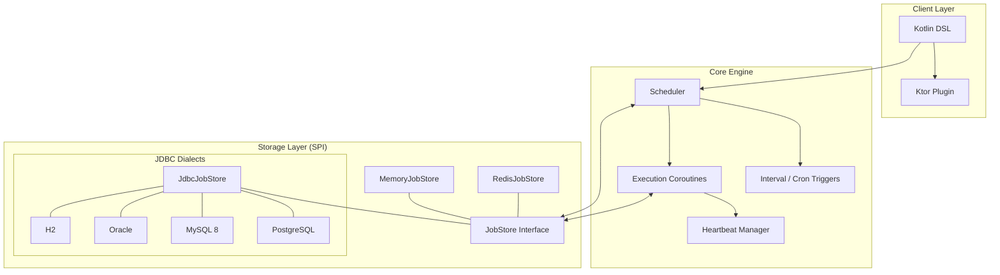
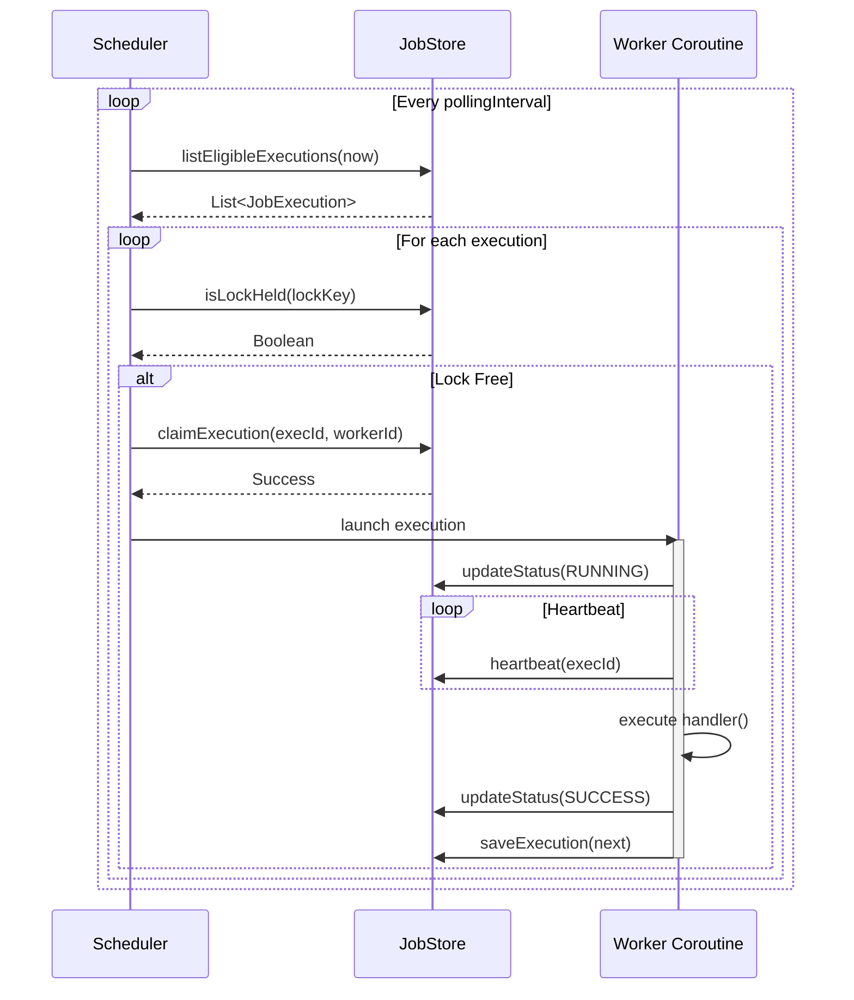

# ARCHITECTURE — Khrona

## Component Diagram

## Component Overview
- **Core:** Job definitions, triggers, execution engine.
- **Store SPI:** Pluggable storage layer (`MemoryJobStore`, `JdbcJobStore`, `RedisJobStore`).
- **JdbcDialect:** Abstraction for database-specific SQL (PostgreSQL, MySQL, H2, etc.).
- **RedisJobStore:** Redis-backed scheduler state using namespaced hashes, sorted-set lease indexes, lock indexes, and Lua scripts for atomic claim/supersede transitions.
- **Worker:** Coroutine-based executor polling and heartbeating.
- **Ktor Plugin:** Integration bridge for Ktor lifecycle and routing.

## Execution Flow

1. **Definition:** User defines jobs via DSL.
2. **Scheduling:** Triggers calculate next run times.
3. **Queueing:** Eligible jobs are moved to the queue (store-specific).
4. **Claiming:** Workers claim jobs from the store.
5. **Execution:** Jobs run in a managed CoroutineScope.
6. **Completion:** Results/Errors are persisted; retries scheduled if needed.
