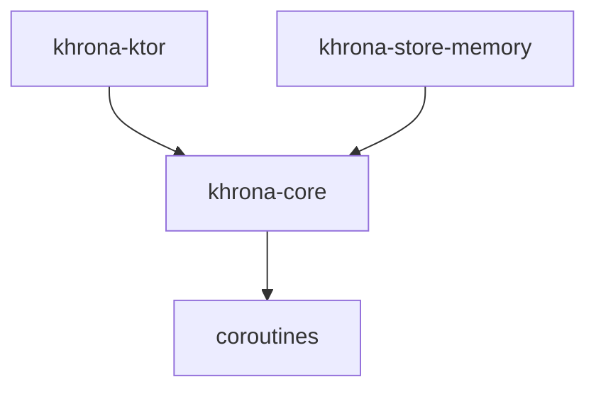

# Design: v0.1 - Core & In-Memory

## 1. Architecture

### 1.1 Module Structure


- **`khrona-core`**: Definitions, Interfaces, Runtime, Triggers.
- **`khrona-store-memory`**: Concrete implementation of `JobStore`.
- **`khrona-ktor`**: Ktor Plugin and lifecycle management.

### 1.2 Core Components
- `JobStore`: Interface for persisting and claiming jobs.
- `Scheduler`: The main coordinator that manages the execution scope and polling loop.
- `Worker`: Individual coroutine unit that claims and executes a single job.
- `Trigger`: Interface for calculating `nextExecutionTime`.

## 2. Data Flow
1. `Scheduler` polls `JobStore` for eligible jobs.
2. `Scheduler` launches `Worker` coroutines for each job.
3. `Worker` updates `JobExecution` status in `JobStore`.

## 3. DSL Design
```kotlin
val khrona = Khrona {
    store = MemoryJobStore()
    
    job("my-job") {
        every(5.minutes)
        execute {
            println("Running")
        }
    }
}
```

## 4. Gradle Setup
- Root `build.gradle.kts` with `allprojects` and `subprojects` configuration.
- Version catalog `gradle/libs.versions.toml` for dependency management.
