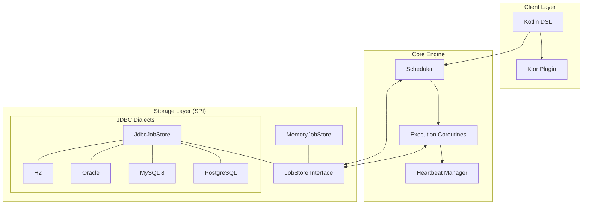

# Khrona

**Khrona** is a coroutine-native job scheduling and background execution runtime designed for Kotlin and deeply integrated with Ktor.

It provides a reliable, idiomatic, and production-capable platform for background tasks, ranging from simple recurring jobs to distributed-safe persistent executions.

> **Etymology:** The name **Khrona** is inspired by **Chronos** (Ancient Greek: χρόνος, “time”), the personification of time and the root of modern terms like “chronology.” The stylized spelling reflects a modern, system-oriented interpretation of temporal control and scheduling.

## Features

- **🚀 Coroutine-native:** Built on Kotlin coroutines for efficient, non-blocking execution.
- **🛠️ Fluent DSL:** Define jobs and schedules using a clean, Kotlin-first DSL.
- **⏱️ Flexible Triggers:**
  - **Interval:** Run jobs at fixed durations (e.g., every 5 minutes).
  - **Cron:** Standard Unix-format cron expressions (`* * * * *`).
- **🛡️ Reliability & Resilience:**
  - **Retry Policies:** Configurable exponential backoff with jitter.
  - **Concurrency Control:** Manage overlapping executions with `FORBID` or `REPLACE` policies.
  - **Misfire Policies:** Handle delayed executions (FIRE_NOW or IGNORE).
- **💾 Persistence Support:** Durable job storage using JDBC (PostgreSQL, MySQL, Oracle, H2).
- **🌐 Distributed Ready:** Multi-node deployment support with deterministic IDs and distributed locking.
- **🔌 Ktor Integration:** First-class Ktor plugin with seamless lifecycle management.

## Architecture at a Glance



> For a detailed breakdown of the execution flow and sequence diagrams, see the [Full Architecture Document](.specs/codebase/ARCHITECTURE.md).

## Installation

```kotlin
// build.gradle.kts
dependencies {
    implementation("io.github.juniormichieletto:khrona-ktor:0.1.1")
    
    // Choose your storage:
    implementation("io.github.juniormichieletto:khrona-store-memory:0.1.1") // For dev/testing
    implementation("io.github.juniormichieletto:khrona-store-jdbc:0.1.1")   // For production
}
```

## Quick Start (In-Memory)

The fastest way to get started with Ktor using ephemeral in-memory storage.

```kotlin
import io.khrona.ktor.*
import io.khrona.store.memory.MemoryJobStore
import kotlin.time.Duration.Companion.minutes

fun Application.module() {
    install(Khrona) {
        store = MemoryJobStore()
    }

    scheduler {
        job("heartbeat") {
            every(1.minutes)
            execute {
                log.info("Khrona is alive!")
            }
        }
    }
}
```

## Persistent Storage (JDBC)

For production use, jobs should persist across application restarts.

```kotlin
import io.khrona.store.jdbc.JdbcJobStore
import io.khrona.store.jdbc.PostgresDialect // Or MySqlDialect, H2Dialect, etc.

val store = JdbcJobStore(dataSource, PostgresDialect()).apply { migrate() }

install(Khrona) {
    this.store = store
}
```

## MySQL 8 & Multi-Node Testing

Khrona is designed to scale across multiple instances. Use a persistent store to coordinate work.

### Local Multi-Instance Setup
To test distributed locking and claiming locally, start a MySQL container:

```bash
docker run -d --name khrona-mysql \
  -e MYSQL_DATABASE=khrona_db \
  -e MYSQL_USER=khrona_user \
  -e MYSQL_PASSWORD=khrona_password \
  -e MYSQL_ROOT_PASSWORD=root \
  -p 3306:3306 mysql:8.0
```

To stop and clean up:
```bash
docker stop khrona-mysql && docker rm khrona-mysql
```

Run two instances of your app in different terminals:
```bash
# Terminal 1
NODE_NAME=node-1 ./gradlew run

# Terminal 2
NODE_NAME=node-2 ./gradlew run
```
Only one node will claim and execute the job at a time if `concurrencyPolicy = ConcurrencyPolicy.FORBID` is used.

## Advanced Configuration

### Retry Policies
Handle failures gracefully with configurable exponential backoff.

```kotlin
job("payment-sync") {
    every(1.hours)
    retry {
        maxAttempts = 5
        initialDelay = 10.seconds
        maxDelay = 1.hours
        factor = 2.0 // Exponential growth
        jitter = 0.1 // 10% randomization
    }
    execute {
        // Sync logic that might fail
    }
}
```

### Concurrency & Locking
Prevent a job from running if a previous execution is still active globally. `lockKey` defaults to the job ID.

```kotlin
job("heavy-task") {
    every(5.minutes)
    concurrencyPolicy = ConcurrencyPolicy.FORBID
    timeout = Duration.ofMinutes(15)   // Max execution time coroutine
    execute {
        // Only one instance of this job runs at a time globally
    }
}
```

### Misfire Policies
Define what happens if a job misses its scheduled time (e.g., due to downtime).

```kotlin
job("report") {
    cron("0 0 * * *")
    misfirePolicy = MisfirePolicy.IGNORE // Skip if more than 60s late
    execute { ... }
}
```

### Correlation ID & Observability
Khrona automatically manages `correlationId` propagation via Slf4j MDC, making it easy to trace a specific job execution across your logs.

- **Uniqueness**: Every new recurring run or manual trigger gets a unique `correlationId`.
- **Retries**: Retries of a failing execution **share the same ID**, allowing you to trace the entire lifecycle of a specific attempt.
- **Propagation**: If you register or trigger a job from a context that already has a `correlationId` in the MDC (like a Ktor request), Khrona will capture and use it.

To show the ID in your logs, update your `logback.xml` pattern to include `%X{correlationId}`:

```xml
<pattern>%d{HH:mm:ss.SSS} [%thread] %-5level %logger - [%X{correlationId}] %msg%n</pattern>
```

## Manual Control (Standalone)

You can also run Khrona outside of Ktor:

```kotlin
val config = Khrona {
    store = MemoryJobStore()
    pollingInterval(5.seconds)
}

val scheduler = Scheduler(config)
scheduler.start()

// Register jobs dynamically
scheduler.registerJob(JobDefinition(...))

// Run a job once immediately
scheduler.registerJob(job("one-time-task") {
    once()
    execute {
        println("Running once!")
    }
})

// Schedule a job for a specific time
scheduler.registerJob(job("delayed-task") {
    at(Instant.now().plus(Duration.ofHours(1)))
    execute {
        println("Running after 1 hour")
    }
})

// Manually trigger an existing job with a custom payload
scheduler.trigger("my-job-id", payload = "Ad-hoc trigger data")

// Stop cleanly
scheduler.stop()
```

## Trigger Formats

### Cron Trigger (Unix Format)
Khrona uses the standard **Unix 5-field format**: `min hour dom month dow`.

> **Note:** All cron expressions are evaluated in **UTC** time.

- `* * * * *` : Every minute
- `0 * * * *` : Every hour
- `30 5 * * 1` : Every Monday at 05:30 UTC

### Interval Trigger
Use Kotlin's `Duration` for human-readable intervals:
- `every(30.seconds)`
- `every(1.hours)`

## Roadmap

- [x] **v0.1:** Core engine, Kotlin DSL, Ktor integration.
- [x] **v0.2:** Persistence support (Postgres, H2), retries, and dead-letter handling.
- [x] **v0.3:** Distributed execution, lease-based claiming, and concurrency policies.
- [ ] **v0.4:** Admin UI & Dashboard, Metrics (Micrometer).
- [ ] **v0.5:** SQLite storage support (Android friendly), Redis-backed distributed locking.
- [ ] **v0.6:** Performance tuning and advanced misfire policies.

## License

Apache License 2.0
