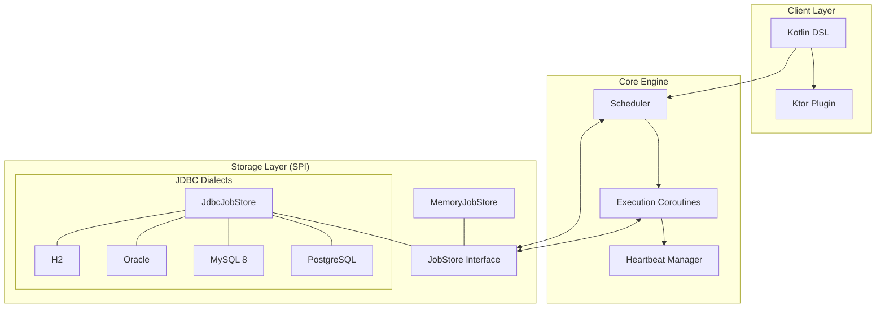

# Khrona

**Khrona** is a coroutine-native job scheduling and background execution runtime designed for Kotlin and deeply integrated with Ktor.

It provides a reliable, idiomatic, and production-capable platform for background tasks, ranging from simple recurring jobs to distributed-safe persistent executions.

> **Etymology:** The name **Khrona** is inspired by **Chronos** (Ancient Greek: χρόνος, “time”), the personification of time and the root of modern terms like “chronology.” The stylized spelling reflects a modern, system-oriented interpretation of temporal control and scheduling.

## Features

- **🚀 Coroutine-native:** Built on Kotlin coroutines for efficient, non-blocking execution.
- **🛠️ Fluent DSL:** Define jobs and schedules using a clean, Kotlin-first DSL.
- **⏱️ Flexible Triggers:**
  - **Interval:** Run jobs at fixed durations (e.g., every 5 minutes).
  - **Cron:** Standard Unix-format cron expressions (`* * * * *`) with optional per-job timezones.
- **🛡️ Reliability & Resilience:**
  - **Retry Policies:** Configurable exponential backoff with jitter.
  - **Concurrency Control:** Manage overlapping executions with `FORBID` or `REPLACE` policies.
  - **Misfire Policies:** Handle delayed executions (FIRE_NOW or IGNORE).
- **💾 Persistence Support:** Durable job storage using JDBC (PostgreSQL, MySQL, Oracle, H2).
- **🌐 Distributed Ready:** Multi-node deployment support with deterministic IDs and distributed locking.
- **🔌 Ktor Integration:** First-class Ktor plugin with seamless lifecycle management.

## Architecture at a Glance



> For a detailed breakdown of the execution flow and sequence diagrams, see the [Full Architecture Document](.specs/codebase/ARCHITECTURE.md).

## Installation

```kotlin
// build.gradle.kts
dependencies {
    implementation("io.github.juniormichieletto:khrona-ktor:0.3.3")
    
    // Choose your storage:
    implementation("io.github.juniormichieletto:khrona-store-memory:0.3.3") // For dev/testing
    implementation("io.github.juniormichieletto:khrona-store-jdbc:0.3.3")   // For production
}
```

## Quick Start (In-Memory)

The fastest way to get started with Ktor using ephemeral in-memory storage.

```kotlin
import io.khrona.ktor.*
import io.khrona.store.memory.MemoryJobStore
import kotlinx.coroutines.launch
import kotlin.time.Duration.Companion.minutes

fun Application.module() {
    install(Khrona) {
        store = MemoryJobStore()
    }

    launch {
        scheduler {
            job("heartbeat") {
                every(1.minutes)
                execute {
                    println("Khrona is alive!")
                }
            }
        }
    }
}
```

## Persistent Storage (JDBC)

For production use, jobs should persist across application restarts.

```kotlin
import io.khrona.store.jdbc.JdbcJobStore
import io.khrona.store.jdbc.PostgresDialect // Or MySqlDialect, H2Dialect, etc.
import kotlinx.coroutines.runBlocking

val store = JdbcJobStore(dataSource, PostgresDialect())
runBlocking { store.migrate() }

install(Khrona) {
    this.store = store
}
```

`migrate()` is suspend and fail-fast: schema errors are surfaced during startup instead of being silently ignored. Re-running migration is idempotent for the built-in schema and indexes.

## MySQL 8 & Multi-Node Testing

Khrona is designed to scale across multiple instances. Use a persistent store to coordinate work.

### Local Multi-Instance Setup
To test distributed locking and claiming locally, start a MySQL container:

```bash
docker run -d --name khrona-mysql \
  -e MYSQL_DATABASE=khrona_db \
  -e MYSQL_USER=khrona_user \
  -e MYSQL_PASSWORD=khrona_password \
  -e MYSQL_ROOT_PASSWORD=root \
  -p 3306:3306 mysql:8.0
```

To stop and clean up:
```bash
docker stop khrona-mysql && docker rm khrona-mysql
```

Run two instances of your app in different terminals:
```bash
# Terminal 1
NODE_NAME=node-1 ./gradlew run

# Terminal 2
NODE_NAME=node-2 ./gradlew run
```
Only one node will claim and execute the job at a time if `concurrencyPolicy = ConcurrencyPolicy.FORBID` is used.

## Advanced Configuration

### Retry Policies
Handle failures gracefully with configurable exponential backoff.

```kotlin
job("payment-sync") {
    every(1.hours)
    retry {
        maxAttempts = 5
        initialDelay = 10.seconds
        maxDelay = 1.hours
        factor = 2.0 // Exponential growth
        jitter = 0.1 // 10% randomization
    }
    execute {
        // Sync logic that might fail
    }
}
```

### Concurrency & Locking
Prevent a job from running if a previous execution is still active globally. `lockKey` defaults to the job ID.

```kotlin
job("heavy-task") {
    every(5.minutes)
    // FORBID: Skip the new run if the old one is still active
    // REPLACE: Claim the new run, then supersede and cancel older active runs for the same lock
    concurrencyPolicy = ConcurrencyPolicy.REPLACE 
    
    timeout = 15.minutes // Enforced via coroutine withTimeout
    
    execute {
        // Safe, bound execution with automatic cancellation support
    }
}
```

### Long-Running Jobs, Timeouts, and Restarts
`timeout` is optional. If a job does not set a timeout, Khrona does not enforce a per-execution runtime limit while the application process is alive. The handler can keep running until it completes, fails, the scheduler is stopped, or the coroutine is cancelled by the host application.

For long-running jobs, set a timeout slightly above the expected maximum runtime so a stuck handler does not stay `RUNNING` forever:

```kotlin
job("long-report") {
    once()
    timeout = java.time.Duration.ofHours(21)

    execute {
        // Expected to complete within about 20 hours
    }
}
```

Persistent stores such as `JdbcJobStore` keep execution state across application restarts. If the application crashes or restarts while a job is `CLAIMED` or `RUNNING`, heartbeats stop, the execution lease eventually expires, and the scheduler can pick the execution up again after restart. This starts the handler again from the beginning; Khrona does not resume from the last line of code that ran.

Design long-running handlers to be idempotent, checkpoint progress externally, or split the work into smaller executions. This avoids duplicate side effects when a restarted or reclaimed execution runs again.

### Graceful Shutdown and Cancellation
`scheduler.stop()` is a suspend function that performs a graceful shutdown:

1. It cancels the scheduler polling loop so no new executions are claimed.
2. It waits for currently active job handlers to finish.
3. If active handlers do not finish before `shutdownTimeout`, it cancels the remaining job coroutines.
4. It releases any still-active executions owned by this scheduler from `CLAIMED` or `RUNNING` back to `PENDING`, so another scheduler can pick them up later.

`shutdownTimeout` defaults to 25 seconds and can be configured on the scheduler:

```kotlin
val config = Khrona {
    store = MemoryJobStore()
    shutdownTimeout(20.seconds)
}
```

If you run Khrona in Kubernetes, keep `shutdownTimeout` lower than the pod's `terminationGracePeriodSeconds`. For example, with Kubernetes' common 30 second grace period, a 20-25 second Khrona shutdown timeout leaves time for cancellation handlers, status updates, connection cleanup, and process exit before the container is killed.

Cancellation is cooperative. Timeouts, `ConcurrencyPolicy.REPLACE`, heartbeat loss, and `scheduler.stop()` timeout cancellation all use coroutine cancellation. A manually triggered execution can also cause an older active execution to be cancelled when the job uses `ConcurrencyPolicy.REPLACE` and the new execution is claimed. Handlers that call cancellable suspending APIs such as `delay`, Ktor HTTP clients, or database drivers with coroutine support will receive `CancellationException` and can clean up in `try/finally` or `catch` blocks:

```kotlin
job("sync-report") {
    every(15.minutes)
    timeout = 10.minutes

    execute {
        try {
            runReportSync()
        } finally {
            closeTemporaryResources()
        }
    }
}
```

Blocking or non-cooperative code is not forcibly interrupted by coroutine cancellation. For long-running handlers, prefer cancellable suspending APIs. For CPU-bound or loop-based handlers, call `kotlinx.coroutines.ensureActive()` or `yield()` at safe points so cancellation can be observed promptly. Keep side effects idempotent so a released or timed-out execution can be retried safely.

### Structured Payloads
Khrona preserves JSON-compatible payload structure when using persistent storage (JDBC). Maps, Lists, strings, numbers, booleans, and nested combinations round-trip through `payload_json`.

Malformed persisted payload JSON fails fast when an execution is loaded, so corrupt or manually edited payload data is surfaced at the store boundary instead of being passed to job handlers as a raw string.

> For custom classes, pass an explicit JSON-compatible representation today. Payload schema/version helpers are planned as a future hardening area.

```kotlin
// Triggering with a complex payload
scheduler.trigger("report-job", payload = mapOf(
    "id" to 123,
    "filters" to listOf("ACTIVE", "PENDING")
))

// Inside the job handler, the structure is preserved
execute { payload ->
    val data = payload as Map<*, *>
    val id = data["id"] as Long
}
```

### Misfire Policies
Define what happens if a job misses its scheduled time (e.g., due to downtime).

`MisfirePolicy.FIRE_NOW` is the default. When an execution is older than `misfireThreshold`, Khrona runs that delayed execution as soon as it is claimed:

```kotlin
job("report") {
    cron("0 0 * * *")
    // misfirePolicy defaults to MisfirePolicy.FIRE_NOW
    execute { ... }
}
```

Set `MisfirePolicy.IGNORE` when missed executions should be skipped instead:

```kotlin
job("report") {
    cron("0 0 * * *")
    misfirePolicy = MisfirePolicy.IGNORE // Skip if more than 60s late
    execute { ... }
}
```

For cron jobs, `IGNORE` marks the delayed execution as `MISFIRED` and schedules the next cron occurrence after the current time. If the cron trigger has a timezone, that next occurrence is calculated using the configured timezone and then stored as a UTC `Instant`.

### Correlation ID & Observability
Khrona automatically manages `correlationId` propagation via Slf4j MDC, making it easy to trace a specific job execution across your logs.

- **Uniqueness**: Every new recurring run or manual trigger gets a unique `correlationId`.
- **Retries**: Retries of a failing execution **share the same ID**, allowing you to trace the entire lifecycle of a specific attempt.
- **Propagation**: If you register or trigger a job from a context that already has a `correlationId` in the MDC (like a Ktor request), Khrona will capture and use it.

To show the ID in your logs, update your `logback.xml` pattern to include `%X{correlationId}`:

```xml
<pattern>%d{HH:mm:ss.SSS} [%thread] %-5level %logger - [%X{correlationId}] %msg%n</pattern>
```

## Manual Control (Standalone)

You can also run Khrona outside of Ktor. Note that registration and triggering are **suspend** functions for better error handling and observability.

```kotlin
val config = Khrona {
    store = MemoryJobStore()
    pollingInterval(5.seconds)
}

val scheduler = Scheduler(config)
scheduler.start()

runBlocking {
    // Register jobs dynamically (suspend function)
    scheduler.registerJob(job("one-time-task") {
        once()
        execute { println("Hello!") }
    })

    // Manually trigger an existing job (suspend function)
    scheduler.trigger("one-time-task", payload = "Ad-hoc data")

    // Stop cleanly
    scheduler.stop()
}
```

## Trigger Formats

### Cron Trigger (Unix Format)
Khrona uses the standard **Unix 5-field format**: `min hour dom month dow`.

`cron(expression)` is evaluated in **UTC** by default:

```kotlin
job("daily-report") {
    cron("0 9 * * *")
    execute { ... }
}
```

Pass a `ZoneId` when the cron expression should follow a local wall-clock schedule:

```kotlin
import java.time.ZoneId

job("weekday-report") {
    cron("0 9 * * 1-5", ZoneId.of("America/New_York"))
    execute { ... }
}
```

- `* * * * *` : Every minute
- `0 * * * *` : Every hour
- `30 5 * * 1` : Every Monday at 05:30 UTC
- `0 9 * * 1-5` with `ZoneId.of("America/New_York")` : Every weekday at 09:00 New York local time

Khrona still stores and compares scheduled executions as UTC `Instant`s. The timezone only controls how cron wall-clock fields are interpreted before the next run is converted back to an `Instant`. Around daylight saving changes, schedules follow the local wall-clock rules for the configured zone; skipped or repeated local times use cron-utils' `ZonedDateTime` behavior.

### Interval Trigger
Use Kotlin's `Duration` for human-readable intervals:
- `every(30.seconds)`
- `every(1.hours)`

## Roadmap

- [x] **v0.1:** Core engine, Kotlin DSL, Ktor integration.
- [x] **v0.2:** Persistence support (Postgres, H2), retries, and dead-letter handling.
- [x] **v0.3:** Distributed execution, lease-based claiming, and concurrency policies.
- [x] **v0.3.3:** Reliability hardening (Registry, Timeouts, Atomic REPLACE).
- [ ] **v0.4:** Admin UI & Dashboard, Metrics (Micrometer).
- [ ] **v0.5:** SQLite storage support (Android friendly), Redis-backed distributed locking.
- [ ] **v0.6:** Performance tuning and advanced misfire policies.

## License

Apache License 2.0
